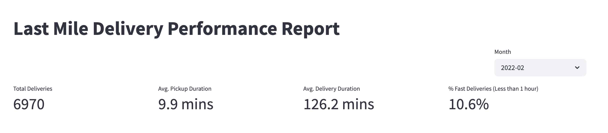
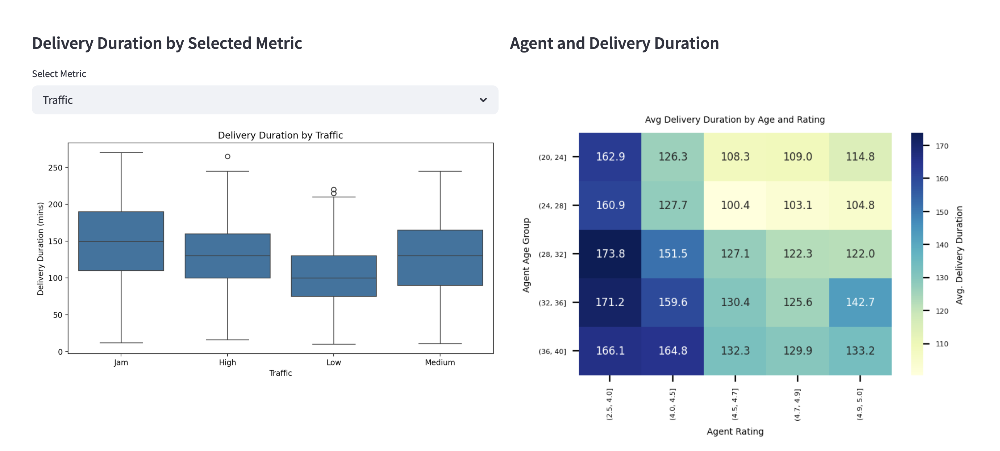
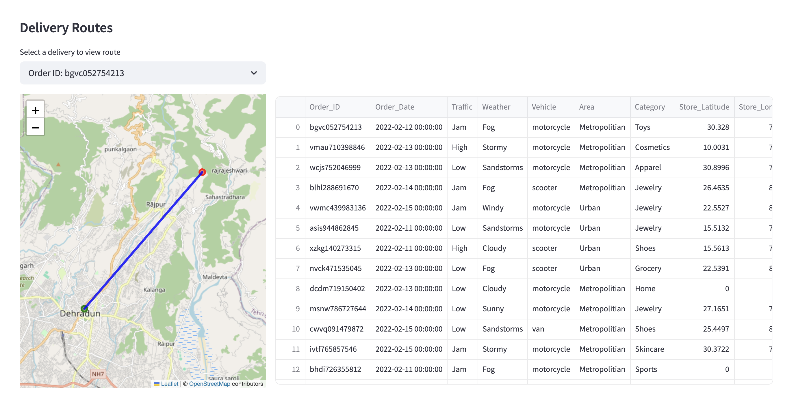

# Last Mile Delivery Analysis

This repository contains a data analysis project focused on exploring and visualizing last mile delivery performance using Amazon delivery data (available on Kaggle)

## Project Overview

The goal of this project is to understand operational patterns, delivery duration variability, and agent performance in the last mile delivery process. The project is divided into three major phases:

1. **Data Cleaning & EDA (Exploratory Data Analysis)**
    Conducted in Jupyter notebooks, this step includes:
    - Handling missing and inconsistent values
    - Feature engineering (e.g. calculating delivery durations, distances)
    - Geospatial analysis and trend detection

2. **Interactive Dashboard Draft (Streamlit)**
    A prototype dashboard was built using Streamlit to visualize:
    - Key performance indicators (KPIs)
    - Delivery duration breakdowns by traffic, weather, area, etc.
    - Heatmaps showing agent age and rating vs. delivery efficiency
    - Interactive maps with store-to-drop routing lines
    - Raw data exploration tools

3. **Finalized Business Dashboard (Power BI)** *(WIP)*
    The Streamlit dashboard serves as a layout draft. The final dashboard will be built in Power BI for stakeholder presentation and executive summary.

## Repository Structure

```
├── dashboard/              # Streamlit app code
├── notebooks/              # Jupyter notebooks for data cleaning and EDA
├── data/                   # Cleaned dataset and source data files
├── images/                 # Screenshots for documentation
├── README.md               # Project overview and instructions
```

## Preview

### Streamlit Dashboard Prototype

*Top KPIs and delivery month dropdown*


*Delivery Performance Breakdown by Environmental Metrics and Agent Characteristics*


*Route Visualization for selected delivery*

## How to Run (Streamlit)

install dependencies:
```bash
pip install -r requirements.txt
```

Launch the app:
```bash
streamlit run dashboard/last_mile_dashboard.py
```

## Future work
- Finalize Power BI dashboard layout and storytelling flow
- Incorporate additional operational insights (e.g. delivery time anomalies, cost efficiency)

## Dataset Source
Kaggle: [Amazon Last Mile Delivery Dataset]( https://www.kaggle.com/datasets/sujalsuthar/amazon-delivery-dataset?resource=download)